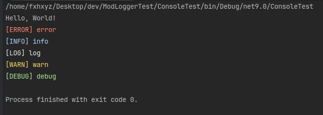

# ModLogger
## .NET logger library (my expressive & modern solution) 

### how to use?
```sh
git clone https://github.com/fxhxyz4/ModLogger.git && cd ModLogger &&
sudo chmod +x ./build.sh && ./build.sh && cd .. &&
dotnet add reference ./ModLogger/ModLogger.csproj
```

```csharp
using ModLogger; // enable ModLogger

Console.WriteLine("Hello, World!");

// Error message
ModLog.Error("error");

// Info message
ModLog.Info("info");

// Log message
ModLog.Log("log");

// Warn message
ModLog.Warn("warn");

// Debug message
ModLog.Debug("debug");
```



#

### Log file:
```
logs/23_02_2025.log:

[23:02:2025:22:33:18]: [ERROR] error
[23:02:2025:22:33:18]: [INFO] info
[23:02:2025:22:33:18]: [LOG] log
[23:02:2025:22:33:18]: [WARN] warn
[23:02:2025:22:33:18]: [DEBUG] debug
```

#

### how to remove it?
```sh
dotnet remove reference ../../ModLogger/ModLogger.csproj
```

